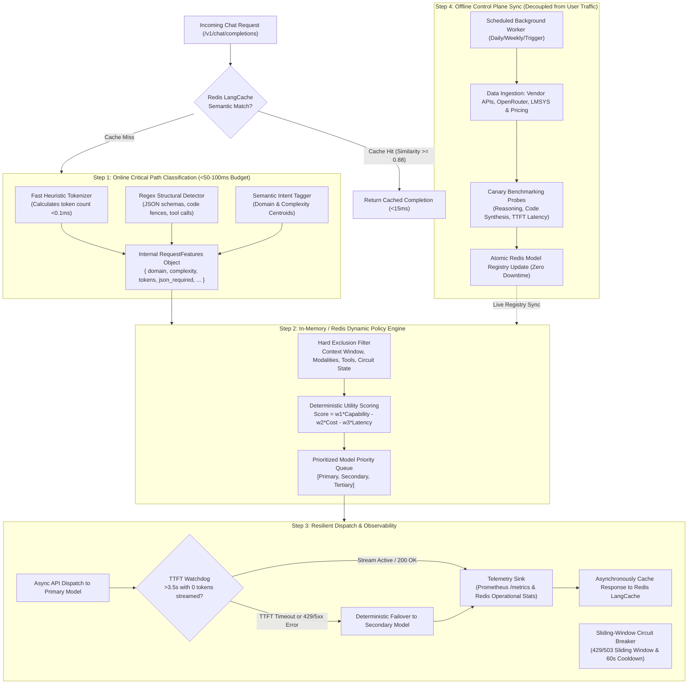

# LLMRouter Intelligent Routing Pipeline Architecture

This document describes the end-to-end architecture of LLMRouter's intelligent routing pipeline, featuring sub-50ms request classification, Redis LangCache semantic caching, in-memory dynamic policy engine, resilient circuit breaking with deterministic failover, and decoupled offline control-plane sync.

---

## Architecture Overview & Pipeline Flow



---

## Detailed Component Breakdown

### 1. Redis LangCache: High-Performance Semantic Caching
Before routing a prompt through the classification and policy engine, LLMRouter checks **Redis LangCache**:
- **Semantic Similarity Lookup**: The incoming user prompt is compared against the semantic vector index in Redis LangCache.
- **Cache Hit (`Similarity >= 0.88`)**: If a semantically equivalent query has already been answered, LLMRouter returns the cached response directly to the client in **< 15ms**, bypassing upstream LLMs completely and saving 100% of the token cost.
- **Cache Miss**: If no match exists above the threshold, execution continues to Step 1. Successful model completions are asynchronously saved back to Redis LangCache.
- **Dual-Layer Resilience**: If Redis is not configured or temporarily unreachable, the gateway seamlessly falls back to a high-speed embedded in-memory semantic cache with LRU eviction.

---

### 2. Step 1: Request Ingestion & Fast Classification (Online Critical Path)
When a prompt enters the system, LLMRouter extracts deep request features within a budget of **under 50–100ms** (actual Go implementation executes in **< 2–5ms**):
- **Heuristic Extraction**:
  - A lightweight tokenizer approximates token counts instantaneously.
  - Precompiled regex scanners check for structured output indicators (e.g. JSON schemas, code fences ```` ````, tool/function calling keywords).
- **Semantic Intent Tagger**:
  - A fast, low-parameter classifier using term-frequency and task centroid vectors categorizes the prompt into:
    - **Task Domain**: `math`, `multi_hop_reasoning`, `creative_writing`, `code_generation`, or `routine_extraction`.
    - **Complexity Tier**: `low` (simple Q&A), `medium` (structured synthesis), or `high` (deep reasoning / algorithmic design).
    - **Hard Constraints**: Multimodal inputs (images, audio), function/tool-calling requirements, or large context demands (>128k tokens).
- **Output Payload**:
  ```json
  {
    "domain": "code_generation",
    "complexity": "high",
    "input_tokens": 3200,
    "json_required": true,
    "tools_required": false,
    "multimodal": false,
    "classification_ms": 3
  }
  ```

---

### 3. Step 2: Model Registry & Dynamic Policy Engine (In-Memory / Redis Lookup)
Rather than performing live web searches to check model capabilities on each request, the system evaluates the prompt payload against an in-memory registry backed by Redis:
- **Registry Schema**:
  Each registered model stores deterministic metadata:
  - Supported context window (e.g. 128k, 1M, 2M) and modalities (`text`, `vision`, `audio`).
  - Cost per 1M input / output tokens.
  - Domain performance index (benchmark percentiles in HumanEval, GPQA, GSM8K, Arena Elo).
  - Provider-level operational stats (rolling average TTFT, P95 latency, error rate).
- **Hard Exclusion**:
  - Eliminates any model whose maximum context window is smaller than `input_tokens`.
  - Eliminates any model lacking required capabilities (e.g. native tools, vision).
  - Eliminates models whose provider circuit breaker is currently open or rate-limited.
- **Utility Scoring**:
  Surviving candidates are ranked using a deterministic utility function:
  $$\text{Score} = w_1 \cdot \text{Capability}(domain) - w_2 \cdot \text{CostNorm} - w_3 \cdot \text{LatencyNorm}$$
  Weights can be selected from presets (`Balanced`, `Quality-First`, `Cost-Saver`, `Ultra-Fast`) or customized per deployment.
- **Output**: A prioritized priority queue of models:
  ```json
  [
    { "model": "gpt-4o", "score": 0.94, "role": "primary" },
    { "model": "gemini-2.5-pro", "score": 0.89, "role": "secondary" },
    { "model": "llama-3.3-70b-versatile", "score": 0.82, "role": "tertiary" }
  ]
  ```

---

### 4. Step 3: Execution, Circuit Breaker & Fallback Layer
This layer executes the request while insulating the client from upstream provider downtime, rate limits, or transient timeouts:
- **API Dispatch**: Initiates the call to the primary model via an asynchronous client.
- **Sliding-Window Circuit Breakers**:
  - A sliding window monitors provider error rates. If a specific provider starts throwing repeated `429` (Rate Limit) or `503` (Overloaded) errors, the circuit breaker trips to `open` and temporarily diverts traffic away for a 60-second cooldown window before allowing a canary probe in `half-open` state.
- **Deterministic Failover (TTFT Watchdog)**:
  - If the primary call fails or hits a hard timeout (e.g. 3.5 seconds with zero streamed tokens received), the router instantly aborts that connection and executes the secondary model from Step 2.
- **Telemetry Emission**:
  - Emits metrics (TTFT, latency, total tokens billed, HTTP status) to Prometheus (`/metrics`) and feeds rolling operational latency back into the Redis Model Registry.
  - Asynchronously stores prompt and completion in Redis LangCache.

---

### 5. Step 4: Asynchronous Background Sync (Offline Control Plane)
Replaces live internet queries during user requests, decoupling model discovery entirely from user traffic:
- **Scheduled Workers**: A background cron job runs at regular intervals (daily, weekly, or on-demand trigger).
- **Data Ingestion**: Scrapes or pulls from vendor API update logs, public evaluation leaderboards (LMSYS, Artificial Analysis), and pricing endpoints.
- **Canary Benchmarking**: Runs a standardized battery of probe prompts (mathematical reasoning, code generation, TTFT latency) against newly released model endpoints to compute baseline latency and output quality before they are made live.
- **Atomic Registry Update**: Verified updates (new models, updated context limits, price drops) are written atomically into the Redis Model Registry, making new routing targets available instantly without any service redeployment.
